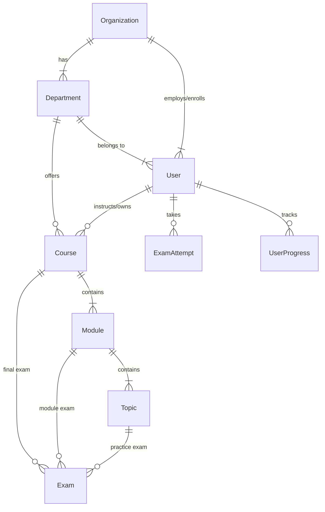

# SkillUp2Dev V2: Postgres Schema Design

This document outlines the schema changes required to support Multi-tenancy, User Hierarchy, and Advanced Assessment logic.

## 1. Entity Relationship Diagram (Conceptual)

## 2. New Tables

### A. Organization (Tenant)
Represents a College or Company.
- `id`: UUID (PK)
- `name`: String
- `domain`: String (e.g., "ideas2it.edu") - *For auto-join logic*
- `subscription_plan`: Enum (FREE, PRO, ENTERPRISE)
- `is_active`: Boolean

### B. Department
Represents a division within an Org (e.g., "Computer Science", "HR").
- `id`: UUID (PK)
- `organization_id`: UUID (FK)
- `name`: String
- `head_of_dept_user_id`: UUID (FK to User, nullable)

### C. Updates to `User` Table
Modify existing `users` table.
- `organization_id`: UUID (FK, nullable for Super Admin)
- `department_id`: UUID (FK, nullable)
- `role`: Enum Change -> `SUPER_ADMIN` (Platform), `ORG_ADMIN`, `DEPT_HEAD`, `TEACHER`, `STUDENT`.

## 3. Assessment & Progress Tables

### A. Exam (Enhanced)
Modify existing `exams` table to support hierarchy.
- `type`: Enum (PRACTICE, MODULE_ASSESSMENT, FINAL_COURSE_EXAM)
- `module_id`: UUID (FK, nullable) - *For Module Exams*
- `course_id`: UUID (FK, nullable) - *For Final Exams*
- `passing_score`: Integer (default 70)
- `is_locked`: Boolean (Locked until prerequisites met)

### B. ImportantQuestions (IQ Set)
New table for collecting important questions.
- `id`: UUID (PK)
- `title`: String ("Unit 1 Important Questions")
- `course_id`: UUID (FK)
- `module_id`: UUID (FK, nullable)
- `created_by_user_id`: UUID (FK)
- `content`: JSON (Array of Q&A objects)
- `is_public`: Boolean (Shared to global library)

## 4. Implementation Steps

1.  **Migration 1 (Orgs)**: Create `organizations` and `departments` tables.
2.  **Migration 2 (Users)**: Add FKs to users, migrate `ADMIN` -> `SUPER_ADMIN`, `CONSUMER` -> `STUDENT` (default).
3.  **Migration 3 (Exams)**: Add `type` and `module_id` columns to exams.
4.  **Migration 4 (IQ)**: Create `important_questions` table.

## 5. Sample Data Flow (Course Assignment)

1.  **Org Admin** creates **Department** "CS".
2.  **Org Admin** invites **Teacher A** to "CS".
3.  **Org Admin** imports "Python Course" from Library -> Clones to Org.
4.  **Dept Head** assigns "Python Course" to "CS" Department.
5.  **Student** in "CS" sees "Python Course" in their dashboard.
